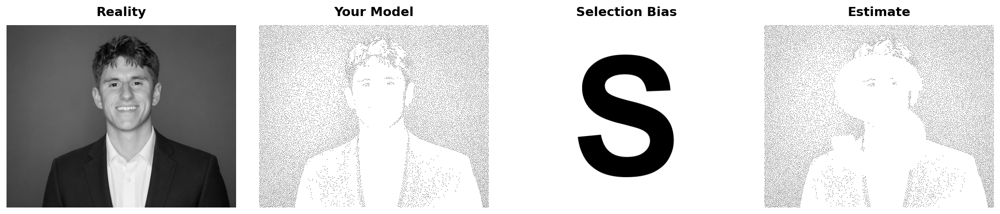

---
format:
  html:
    toc: false
    include-in-header:
      text: |
        <style>#title-block-header{display:none}</style>
pagetitle: "Selection bias meme"
execute:
  echo: false
---

```{python}
#| label: build-meme
#| echo: false
#| fig-show: false
#| output: false

from step1_prepare_image import prepare_image
from step2_create_stipple import create_stipple
from step4_create_block_letter import create_block_letter_s
from step5_create_masked import create_masked_stipple
from create_meme import create_statistics_meme

img_path = "ryan.png"
gray_image = prepare_image(img_path, max_size=512)

stipple_pattern, samples = create_stipple(
    gray_image,
    percentage=0.08,
    sigma=0.9,
    content_bias=0.9,
    noise_scale_factor=0.1,
    extreme_downweight=0.5,
    extreme_threshold_low=0.2,
    extreme_threshold_high=0.8,
    extreme_sigma=0.1,
)

h, w = gray_image.shape
block_letter = create_block_letter_s(h, w, letter="S", font_size_ratio=0.9)

masked_stipple = create_masked_stipple(
    stipple_pattern,
    block_letter,
    threshold=0.5,
)

create_statistics_meme(
    original_img=gray_image,
    stipple_img=stipple_pattern,
    block_letter_img=block_letter,
    masked_stipple_img=masked_stipple,
    output_path="statistics_meme.png",
    dpi=150,
    background_color="white",
)
```



The stippled dots stand in for sampled data points, and the **S** removes observations along a deliberate, repeating pattern rather than at random. The last panel is a biased “estimate”—it no longer matches the full picture because missingness is systematic, which is what selection bias means in practice.
